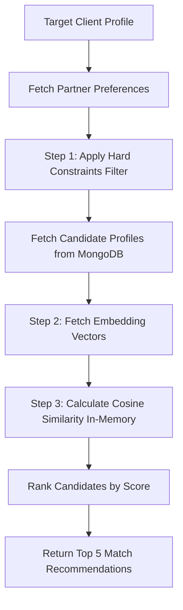

# Hybrid Matchmaking System Plan

This document details the plan to implement a hybrid matchmaking system in the Matchmaker CRM dashboard.

## System Architecture



---

## Step 1: Hard Constraints Filtering

Filter candidates based on non-negotiable requirements using standard MongoDB/Prisma queries. This keeps the database query fast and reduces the subset of candidates to process.

### Hard Filters to Apply:
- **Gender**: Opposite gender or matching preference.
- **Age**: Candidate's age must fall between `minAge` and `maxAge`.
- **City**: Match preferred city if specified (optional constraint).
- **Smoking/Drinking**: Filter based on preferred habits (`NO`, `OCCASIONALLY`, `YES`).
- **Marital Status**: Matches preferred marital status (e.g. `NEVER_MARRIED`).
- **Have Children**: Align on children preferences.
- **Religion/Caste**: Filter on community matching if specified in partner preferences.

---

## Step 2: Soft Matching via Embeddings

Instead of recalculating embeddings dynamically, we generate the embedding vector **once** (on profile creation or update) and store it directly in MongoDB.

### 1. Schema Optimization (`schema.prisma`)
Currently, `schema.prisma` defines the vector as `Unsupported("vector")?`. Since we are computing similarity in-memory, we can simplify this to a native float array:
```prisma
model Profile {
  ...
  embedding Float[] // Store standard vector array in MongoDB
  ...
}
```

### 2. Profile Text Generation
To capture the candidate's personality, values, and lifestyle, we will generate a rich text block combining key qualitative fields:
```typescript
const profileText = `
  About Me: ${profile.aboutMe}
  Lifestyle: ${profile.lifestyle}
  Family Values: ${profile.familyValues}
  Career Goals: ${profile.careerGoals}
  Relationship Values: ${profile.relationshipValues}
  Future Plans: ${profile.futurePlans}
  Hobbies: ${profile.hobbies.join(", ")}
  Personality: ${profile.personalityType}
`;
```

### 3. Embedding Generation Options
We can generate vectors using:
- **Option A (Local & Free)**: Use `@xenova/transformers` with a lightweight local model like `all-MiniLM-L6-v2` (384 dimensions). This runs 100% locally in Node.js, requires no API keys, and has zero cost.
- **Option B (Cloud)**: Use OpenAI's `text-embedding-3-small` (1536 dimensions) or another embedding API (requires API keys and network calls).

---

## Step 3: Match Search (In-Memory Similarity Ranking)

Since standard hard constraints narrow the pool down to a relatively small subset of eligible profiles (e.g., 5 to 50 profiles), we can safely and quickly compute vector similarity **in memory** inside our Next.js backend. This avoids the need to set up complex MongoDB Atlas Vector Search indexes.

### Cosine Similarity Formula
$$Similarity(A, B) = \frac{A \cdot B}{\|A\| \|B\|} = \frac{\sum_{i=1}^{n} A_i B_i}{\sqrt{\sum_{i=1}^{n} A_i^2} \sqrt{\sum_{i=1}^{n} B_i^2}}$$

---

## Implementation Tasks

### Task 1: Update Schema & Seed Data
1. Modify `schema.prisma` to replace `embedding Unsupported("vector")?` with `embedding Float[]`.
2. Update the seed script (`prisma/seed.ts`) to pre-generate and save dummy embedding vectors (e.g., random arrays of length 384) for our 100 seeded profiles so the matching algorithm immediately has data to work with.

### Task 2: Implement Matchmaker Core (`src/lib/matching.ts`)
Implement the following helper functions:
- `generateProfileText(profile)`: Compiles profile details into a single descriptive text block.
- `getEmbedding(text)`: Calls the embedding generator (OpenAI or Local Transformers) to fetch the vector.
- `cosineSimilarity(vecA, vecB)`: Standard array-based math function.
- `findTopMatches(profileId)`: 
  1. Fetches the target profile and its `PartnerPreference`.
  2. Queries MongoDB for all profiles matching the hard constraints.
  3. Computes cosine similarity between the target profile vector and each candidate vector in-memory.
  4. Sorts candidates by score in descending order.
  5. Returns the top 5 matches.

### Task 3: API Endpoint Integration
Expose matching recommendations via an API endpoint (e.g. `/api/customers/[id]/matches`) which calls the matching library to return the top 5 suggestions to the dashboard UI.
